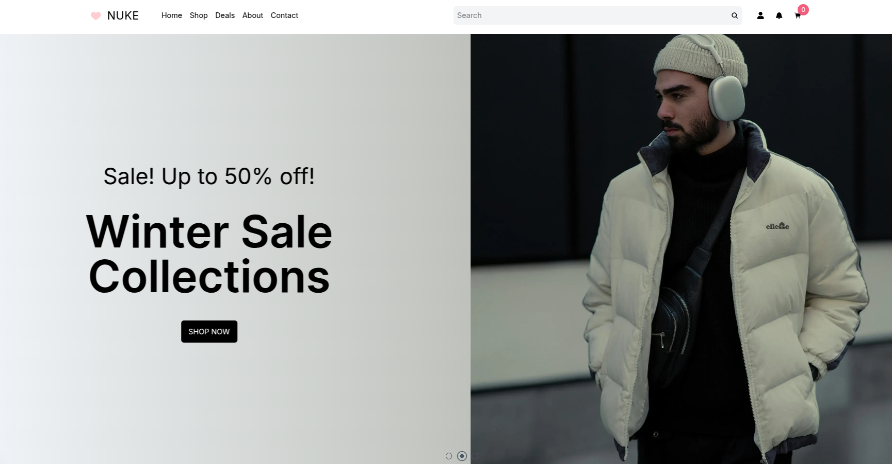
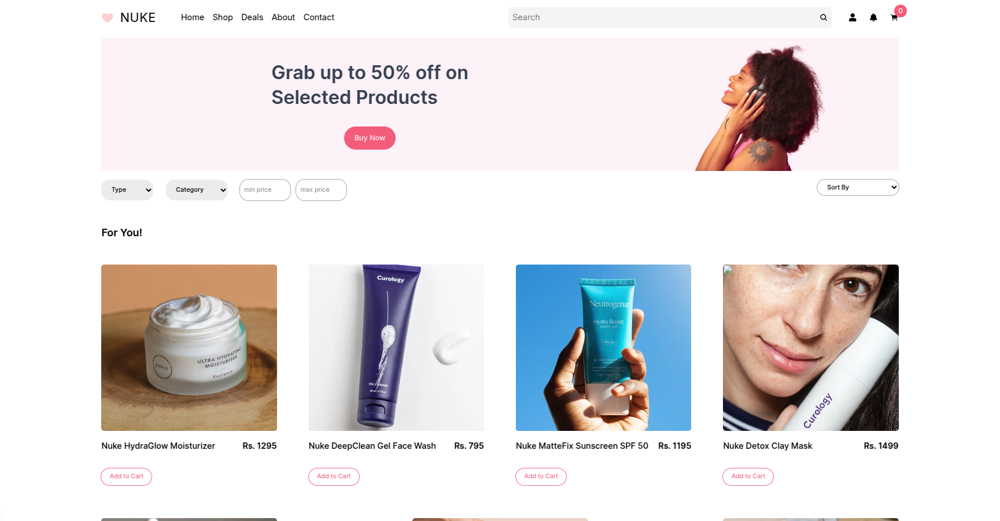

# ⚡ Nuke

**Nuke** is a blazing-fast eCommerce web app built to deliver a seamless, modern shopping experience. Whether you're browsing, adding items to your cart, or checking out securely — everything feels smooth, responsive, and effortless.

## Preview

Click here for [Live Demo](https://nuke-p4rh.vercel.app/)




## ✨ Features

- **Fully Functional Shopping Cart**  
  Add, remove, or update items instantly with a clean, intuitive cart experience.

- **User Authentication**  
  Secure login system with refresh token support, so your session stays safe and smooth.

- **Dynamic Product Pages**  
  Every product has its own beautifully designed page with detailed info and image previews.

- **Real-Time Search**  
  Find what you're looking for instantly using a responsive search bar powered by searchParams.

- **Secure Checkout Flow**  
  Complete purchases with a clear and responsive checkout process.

- **Mobile-First Design**  
  Optimized for all devices — from desktops to smartphones.

- **Lightning-Fast Load Times**  
  Built with performance in mind so users never wait around.

- **Sleek, Minimal UI**  
  Clean layouts, modern animations, and a bold visual experience.

## 🚀 Getting Started

Clone the project and get it running in minutes:

```bash
git clone https://github.com/yourusername/nuke.git
cd nuke
npm install
npm run dev
```

## Tech Stack

- Next.js 15
- TypeScript
- Tailwind CSS
- App Router
- Cookies-based Auth
- Wix
- Vercel

## Contribution

Pull requests are welcome.
